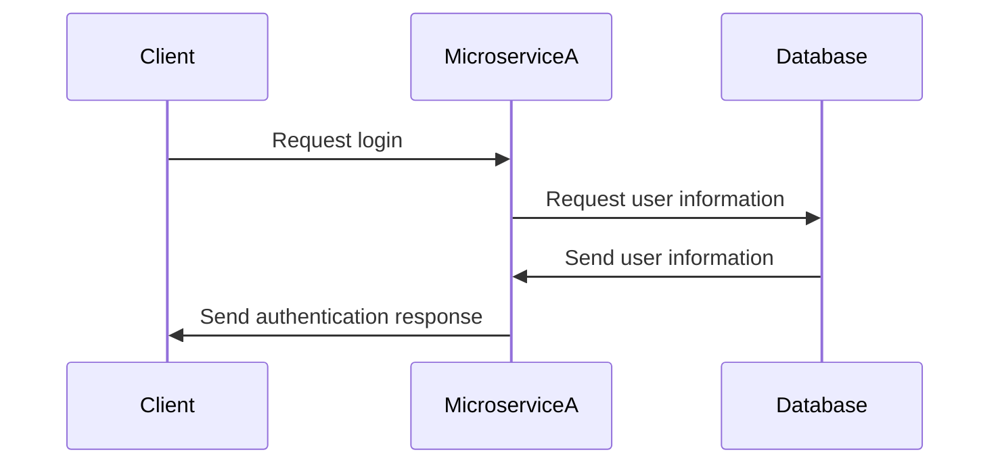

# Microservice A using Flask

## How to Request Data from Microservice A

* Make POST request to <http://flip2.engr.oregonstate.edu:56329/auth> with json payload:
  * {"email": "some email", "password": "some password"}

## How to Receive Data from Microservice A

* POST request returns json data with either
  * {"auth_message": True}
  * {"auth_message": False}

## UML Sequence

